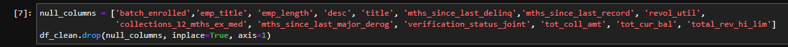
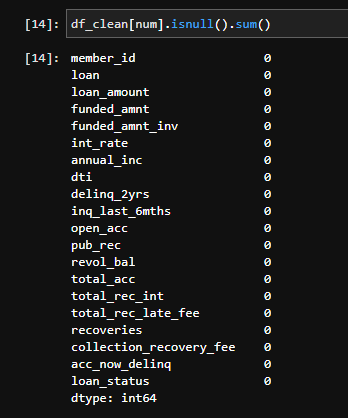
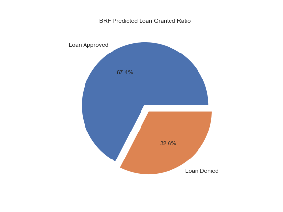
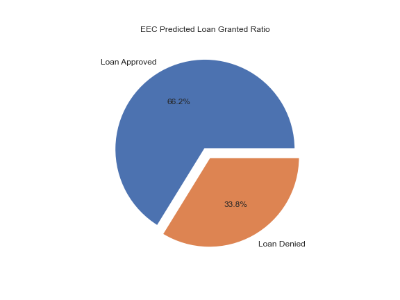
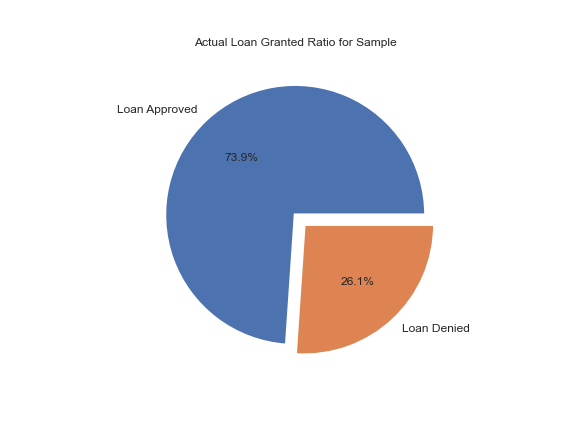
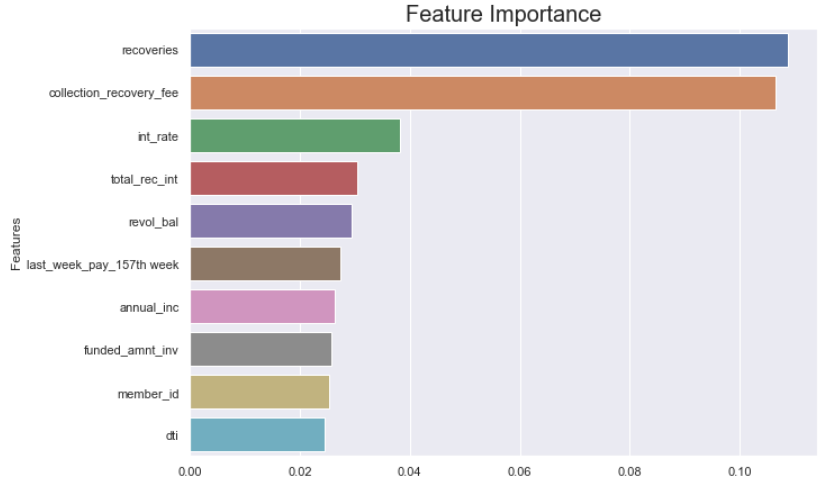

# Approve My Loan
## Problem Statement
The primary task is to predict whether bank customers are eligible to receive a home loan or not on the basis of personal and financial characteristics.

A secondary objective was to design a Bot in AWS to approve or decline loans based on a customer's input data. 

Data set is located at the following link: [Customer Loan Information](https://github.com/Lucis-1/P2_Loan_Predictor/blob/beb3a790c1084fb4844f19c4121474562cc4541f/Customer_info.csv)

## Model Summary

Machine Learning will be used to analyse the data set with a focus given to the following Scikit Learn models:

- Random Forest Classifier 
- Easy Ensemble Classifier 
- Logistic Regression
- Random Oversampling 
- Undersampling: Cluster Centriods
- SMOTE Oversampling
- XGB Boost - used for execution speed and model performance

## Data & Libraries Import & Analysis

. The data contained 64,000 entries with 45 columns of customer data.

. The overall loan amounts varied from $500 to $35,000, therefore we multiplied those amounts by a factor of 20 to increase the size of the loan to better represent home loans.

. The loan data was also from the United States, not Australian data which may skew the final results. 

## Data Wrangling & Data Cleaning

. We were unable to compute using the full data set as there were 2.8 million cells to be read. We had to reduce the size of the data set to 2,500 rows selected at random. 

. Data set included nulls and superflous columns so these were removed as part of the cleaning process. 

. Numeric and categorical columns were defined:

## Exploratory Data Analysis 

. Correlation map shows mainly negatively correlated attributes:

. No nulls for Numeric columns:

## Data Pre-Processing 

. Splitting and scaling the data 

## Machine Learning Algorithm Results
### Balanced Accuracy Score

### Precision

### Recall 

## Result Analysis

The most accurate model was tied between the Balanced Random Forest and Easy Ensemble Classifier which predicted results with a BAS of 0.784396.

This was due to both models balancing out an imbalanced data set which was unique to our data set (Loan approvals were 75% and loan declines were 25%). 

Recoveries were the most important feature when determining loan approval status.

